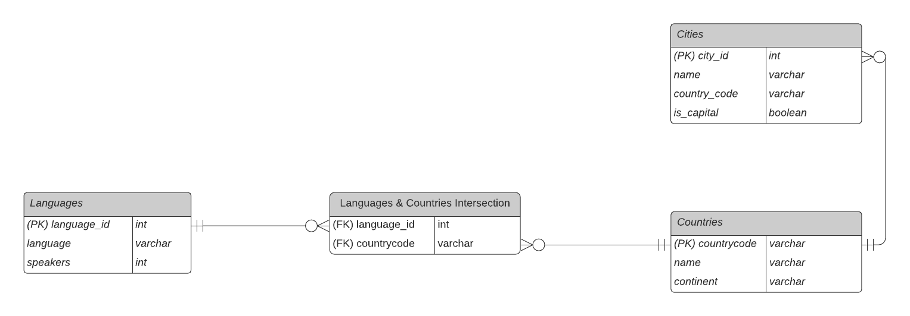

# languages-api
## CS 406 Project
[](https://circleci.com/gh/mike-osu/languages-api/tree/main)

---
## RESTful Web Service - Official Languages by Country
Sources:
- [List of official languages by country and territory](https://en.wikipedia.org/wiki/List_of_official_languages_by_country_and_territory)
- [List of languages by total number of speakers](https://en.wikipedia.org/wiki/List_of_languages_by_total_number_of_speakers)

---

### Technologies:
- [Java 8](https://www.oracle.com/java/technologies/java8.html)
- [Spring Boot 2.6](https://spring.io/projects/spring-boot)
- [Hibernate ORM](https://hibernate.org/orm/)
- [MySQL 8.0](https://www.mysql.com/)
- [Docker](https://www.docker.com/)
- [IntelliJ IDEA Ultimate](https://www.jetbrains.com/idea/business/)

---

```
[
	{
		"id": 1,
		"name": "English",
		"speakers": 1132000000,
		"countries": [
			{
				"id": 1,
				"name": "United States",
				"continent": "North America",
				"cities": [
					{
						"id": 2,
						"name": "Los Angeles",
						"capital": false
					},
					{
						"id": 1,
						"name": "Corvallis",
						"capital": false
					}
				]
			},
			{
				"id": 3,
				"name": "Canada",
				"continent": "North America",
				"cities": [
					{
						"id": 4,
						"name": "Ottawa",
						"capital": true
					}
				]
			}
		]
	},
	{
		"id": 2,
		"name": "French",
		"speakers": 280000000,
		"countries": [
			{
				"id": 3,
				"name": "Canada",
				"continent": "North America",
				"cities": [
					{
						"id": 4,
						"name": "Ottawa",
						"capital": true
					}
				]
			},
			{
				"id": 2,
				"name": "France",
				"continent": "Europe",
				"cities": [
					{
						"id": 3,
						"name": "Paris",
						"capital": true
					}
				]
			}
		]
	}
]
```

<p align="center">
    <br />
    
</p>

---
