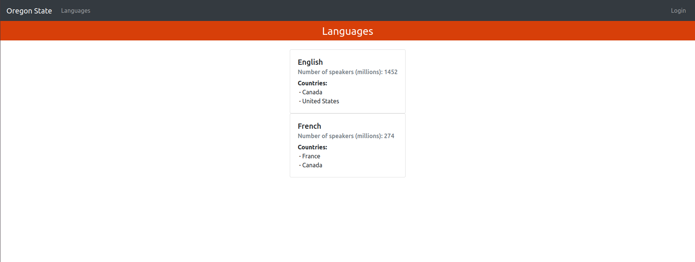

# languages-api
## CS 406 Project
[](https://circleci.com/gh/mike-osu/languages-api/tree/main)

---
## Background

Official Languages by Country<br />
Java/Spring Boot and React Full Stack Web App

---
## How to Run

### Local machine
#### Requirements
- Java 8
- MySQL
- Amazon Cognito user pool & app client
   - User pool ID & App client ID configured in Amazon Secrets Manager
   - can alternatively configure in `application.properties` and modify code accordingly
- locally configured [AWS credentials](https://docs.aws.amazon.com/cli/latest/userguide/cli-configure-files.html) that include Cognito privileges

1. Clone this repo
```
$ git clone ...
$ cd languages-api
```

2. Start mySQL
```
$ docker run -d --name db-container \
	-e MYSQL_ROOT_PASSWORD=Abc12345 \
	-e MYSQL_DATABASE=dev_db \
	-p 3307:3306 mysql
```
(if preferred, can run local or remote instance (e.g. RDS) instead of Docker)

3. Open IDE and run project<br />
http://localhost:8080<br /><br />or create and run .jar file 
```
$ mvn package
$ java -jar target/languages-api.jar
```

4. Run React front-end
```
$ cd frontend
$ npm start
```

5. Navigate to http://localhost:3000

### Docker
1. Project can be run in Docker containers<br  />Update `docker-compose.yml` file with AWS credentials environment variables
```
    environment:
      - AWS_ACCESS_KEY_ID=xxxxxxx
      - AWS_SECRET_ACCESS_KEY=xxxxxxxx
```

2. Run command
```
$ docker-compose up -d
```

3. Run React front-end

4. To stop project
```
$ docker-compose down
```

---
### Technologies:
- [Java 8](https://www.oracle.com/java/technologies/java8.html)
- [Spring Boot 2.6](https://spring.io/projects/spring-boot)
- [Hibernate ORM](https://hibernate.org/orm/)
- [MySQL 8.0](https://www.mysql.com/)
- [Docker](https://www.docker.com/)
- [IntelliJ IDEA Ultimate](https://www.jetbrains.com/idea/business/)
- [Amazon Cognito](https://aws.amazon.com/cognito/)
- [Amazon Secrets Manager](https://aws.amazon.com/secrets-manager/)
- [Swagger UI](https://swagger.io/tools/swagger-ui/)
- [React](https://reactjs.org/)

---
### Progress
- 4/18 - [Secure REST API with Amazon Cognito](https://hackmd.io/@mikeacosta/rywc6vsNq)
- 5/31 - [Languages API image in Docker Hub](https://hub.docker.com/r/mikeacosta/osu-languages-api)
---
<p align="center">
    <br />
    
</p>

---
```
[
	{
		"id": 1,
		"name": "English",
		"speakers": 1132000000,
		"countries": [
			{
				"id": 1,
				"name": "United States",
				"continent": "North America",
				"cities": [
					{
						"id": 2,
						"name": "Los Angeles",
						"capital": false
					},
					{
						"id": 1,
						"name": "Corvallis",
						"capital": false
					}
				]
			},
			{
				"id": 3,
				"name": "Canada",
				"continent": "North America",
				"cities": [
					{
						"id": 4,
						"name": "Ottawa",
						"capital": true
					}
				]
			}
		]
	},
	{
		"id": 2,
		"name": "French",
		"speakers": 280000000,
		"countries": [
			{
				"id": 3,
				"name": "Canada",
				"continent": "North America",
				"cities": [
					{
						"id": 4,
						"name": "Ottawa",
						"capital": true
					}
				]
			},
			{
				"id": 2,
				"name": "France",
				"continent": "Europe",
				"cities": [
					{
						"id": 3,
						"name": "Paris",
						"capital": true
					}
				]
			}
		]
	}
]
```

<p align="center">
    <br />
    
</p>

---
Sources:
- [List of official languages by country and territory](https://en.wikipedia.org/wiki/List_of_official_languages_by_country_and_territory)
- [List of languages by total number of speakers](https://en.wikipedia.org/wiki/List_of_languages_by_total_number_of_speakers)
- [Secure Spring Boot App with JWTs and OAuth 2.0 provided by AWS Cognito](https://kevcodez.de/posts/2020-03-26-secure-spring-boot-app-with-oauth2-aws-cognito/)
- [Configure JWT with Spring Boot and Swagger UI](https://www.javaguides.net/2021/06/configure-jwt-with-spring-boot-and-swagger.html)
- [How to consume a RESTful API in React](https://pusher.com/tutorials/consume-restful-api-react/)

---